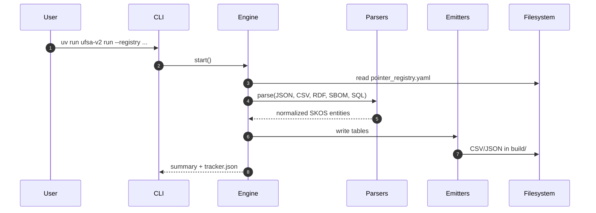

# UFSA v2: Universal Federated Schema Architecture

## Declarative, federated interoperability engine

[](https://github.com/matspike/ufsa2/actions/workflows/ci.yml)
[](https://github.com/matspike/ufsa2/actions/workflows/docs.yml)
[](LICENSE)
[](pyproject.toml)
[](https://docs.astral.sh/ruff/)
[](https://codecov.io/gh/matspike/ufsa2)
[](https://github.com/matspike/ufsa2/actions/workflows/codeql.yml)
[](https://github.com/matspike/ufsa2/releases)

Docs site: <https://matspike.github.io/ufsa2/>

---

### UFSA v2 normalizes diverse public standards

e.g. `FHIR`, `ISO`, `IANA`, `SKOS`, `Shopify`, `OpenFIGI`, `SBOMs`, `SQL DDL` 

into:

- a single semantic layer, and
- portable tables you can ingest anywhere.

## Overview

`UFSA` — the *Universal Federated Schema Architecture v2* (`ufsa2`) — is a declarative, federated interoperability engine which **normalizes diverse public standards** into:

- a **unified** `SKOS`‑based model, and
- **portable tables** for integration purposes.

### Declaration of Declarative Principles

- Standards like `FHIR`, `ISO` specifications, and `OpenFIGI` are structured documents which **fully describe their data models**.
- Rather than manually implementing parsers and mappings for each standard, `UFSA`:
  - provides an **architectural scaffold** which
  - **materializes standards**  into **interoperable artifacts**.

### How It Works

1. **Declaration**: Point to a standard via the registry (`pointer_registry.yaml`)
2. **Ingestion**: The standard's structure is extracted from its native format (`JSON` Schema, `CSV`, `RDF`)
3. **Materialization**: The specification becomes its own parser and semantic model
4. **Normalization**: All standards converge to a unified `SKOS`-based representation
5. **Federation**: Cross-domain mappings emerge from the normalized semantic layer

#### Pipeline stages at a glance

| Stage | Purpose | Sources | Key components | Outputs |
|---|---|---|---|---|
| Declaration | Declare which specs to ingest | `YAML` registry | `pointer_registry.yaml` | Plan for parsers |
| Ingestion | Acquire source artifacts | Local fixtures (now); `HTTP` with cache/pin (later) | Fetcher, scraper | Raw spec files |
| Parsing / Materialization | Turn spec structure into typed entities | `JSON` Schema, `CSV`, `RDF`, `CycloneDX`, `SQL-DDL` | Parsers in `parsers/` | Concepts, schemes, relations |
| Normalization | Align to `SKOS` model | — | Core model in `core_models.py` | Unified in‑memory graph |
| Emission | Persist portable tables | — | Emitters in `emitters/` | Per‑scheme `CSV`/ `JSON` + global tables |

### Architecture diagram


### Practical Impact

- Adding a new standard requires adding a registry entry, not writing code
- Standards updates propagate automatically through re-materialization
- Integration complexity becomes constant rather than linear with standard count
- The system handles FHIR resources, Shopify schemas, ISO standards, and SBOM specifications using the same pipeline

This approach was validated by implementing working parsers for 20+ standards across healthcare, e-commerce, and finance domains in an afternoon supported by local llm tracker-based workflows. The resulting system processes real specifications and produces production-ready normalized outputs.

This repo ships an offline, deterministic bootstrap (fixture‑backed) that cleanly extends to network fetching with caching/pinning.

---

## Table of contents

<table>
  <tbody>
    <tr>
      <td>1. <a href="#overview"><strong>Overview</strong></a></td>
      <td>1a. <a href="#architecture-diagram"><em>Architecture diagram</em></a></td>
      <td>1b. <a href="#target-architecture-at-a-glance"><em>Target architecture at a glance</em></a></td>
      <td>1c. <a href="#project-structure"><em>Project structure</em></a></td>
    </tr>
    <tr>
      <td>2. <a href="#product-and-integration"><strong>Product &amp; integration</strong></a></td>
      <td>2a. <a href="#data-contracts"><em>Data contracts</em></a></td>
      <td>2b. <a href="#integration-patterns"><em>Integration patterns</em></a></td>
      <td>2c. <a href="#versioning-and-reproducibility"><em>Versioning &amp; reproducibility</em></a></td>
    </tr>
    <tr>
      <td>3. <a href="#outputs"><strong>Outputs</strong></a></td>
      <td>3a. <a href="#standards-covered-via-fixtures"><em>Standards covered</em></a></td>
      <td>3b. <a href="#technologies"><em>Technologies</em></a></td>
      <td>3c. <a href="#quick-start"><em>Quick start</em></a></td>
    </tr>
    <tr>
      <td>4. <a href="#development"><strong>Development</strong></a></td>
      <td>4a. <a href="#makefile-targets"><em>Makefile targets</em></a></td>
      <td>4b. <a href="#planning-and-progress"><em>Planning &amp; progress</em></a></td>
      <td>4c. <a href="#tracker-workflow"><em>Tracker workflow</em></a></td>
    </tr>
    <tr>
      <td>5. <a href="#ci"><strong>CI</strong></a></td>
      <td>5a. <a href="#releases"><em>Releases</em></a></td>
      <td>5b. <a href="#contributing"><em>Contributing</em></a></td>
      <td>5c. <a href="#license-sealing-optional"><em>License sealing</em></a></td>
    </tr>
    <tr>
      <td>6. <a href="#notes-on-mappings-and-relations"><strong>Notes on mappings and relations</strong></a></td>
      <td>6a. <a href="#architecture-references"><em>Architecture references</em></a></td>
      <td></td>
      <td></td>
    </tr>
  </tbody>
</table>

---

## Quick links

- Pointer registry: `ufsa_v2/registry/pointer_registry.yaml`
- Engine: `ufsa_v2/engine.py` — Orchestrates the pipeline
- Runtime models: `ufsa_v2/core_models.py`
- Pydantic models (for docs): `ufsa_v2/pyd_models/`
- Parsers: `ufsa_v2/parsers/` — JSON Schema, CSV, RDF, CycloneDX (SBOM), SQL AST
- Emitters: `ufsa_v2/emitters/` — per-scheme and global tables
- Makefile: `Makefile` — common tasks
- Config: `pyproject.toml`, `mkdocs.yml`
- Tracker: `tracker.json`, `TRACKER.md`

---

## Product and integration

[↥ back to top](#ufsa-v2--declarative-federated-interoperability-engine)

UFSA (ufsa2 — Universal Federated Schema Architecture) produces a set of normalized, portable reference tables that encode standards as SKOS concepts and mappings. These artifacts can be imported into a warehouse, joined inside applications, indexed for search, or used to drive schema and identifier alignment across systems.

What you get after a run (default: `build/`)

| category | files |
|---|---|
| Per‑scheme | `scheme_name.concepts.json`, `scheme_name.concepts.csv` |
| Global tables | concept_schemes.csv, concepts.csv, semantic_relations.csv |
| Registries | identifier_systems.csv, mappings.csv |
| Specialized | software_components.csv (SBOM/CycloneDX), database_schemas.csv (SQL AST) |

### Features and maturity

| Capability | Status | Notes |
|---|---|---|
| JSON Schema parser | ✅ Stable | Extracts properties/definitions → SKOS concepts and relations |
| CSV schema parser | ✅ Stable | Structured field CSVs (FHIR, ISO, IANA, Shopify, OpenFIGI) |
| RDF/SKOS ingester | ✅ Stable | Loads core SKOS vocabulary for labels/definitions/mappings |
| CycloneDX SBOM parser | 🟡 Beta | Emits `software_components.csv` with hashes/licenses/refs |
| SQL DDL → AST parser | 🟡 Beta | Emits `database_schemas.csv`, basic FK detection |
| Profiles evaluator | 🟡 Experimental | Apply/check constraints against build outputs |
| Identifier/Mapping registries | 🟡 In progress | Curated links across identifier systems and schemes |

### Data contracts

Stable columns and semantics you can build against:

concept_schemes.csv

| column | type | constraints |
|---|---|---|
| scheme_id | str | pk |
| scheme_label | str |  |
| scheme_uri | str | unique |
| governing_body | str | nullable |

concepts.csv

| column | type | constraints |
|---|---|---|
| concept_id | str | pk; globally unique |
| pref_label | str |  |
| definition | str | nullable |
| notation | str | nullable |
| scheme_uri | str | fk → concept_schemes.scheme_uri |

semantic_relations.csv

| column | type | constraints |
|---|---|---|
| subject_id | str | fk → concepts.concept_id |
| predicate | str | one of skos:broader\|skos:narrower\|skos:related\|skos:exactMatch\|skos:closeMatch\|skos:broadMatch\|skos:narrowMatch |
| object_id | str | fk → concepts.concept_id |

identifier_systems.csv

| column | type | constraints |
|---|---|---|
| id | str | pk |
| name | str |  |
| authority | str |  |
| uri | str | unique |
| description | str | nullable |

mappings.csv

| column | type | constraints |
|---|---|---|
| from_system | str | fk → identifier_systems.id |
| from_value | str |  |
| to_concept_id | str | fk → concepts.concept_id |
| relation | str | e.g., skos:exactMatch |
| note | str | nullable |

software_components.csv (CycloneDX‑derived)

| column | type | constraints |
|---|---|---|
| component_purl | str | pk |
| name | str |  |
| version | str |  |
| licenses | json |  |
| hashes | json |  |
| external_references | json |  |
| scheme_uri | str |  |

database_schemas.csv (SQL AST‑derived)

| column | type | constraints |
|---|---|---|
| table_name | str | pk (with column_name) |
| column_name | str | pk (with table_name) |
| data_type | str |  |
| is_nullable | bool |  |
| fk_table | str | nullable |
| fk_column | str | nullable |

Conventions and guarantees

| topic | guarantee |
|---|---|
| CSV dialect | UTF‑8, comma‑separated, quoted where needed, headers always present |
| Identifiers | concept_id and scheme_uri stable within a minor line (0.Y.Z → stable across Z) |
| Predicates | SKOS vocabulary as strings (no CURIE expansion required) |
| Compatibility | Adding columns allowed; renames/removals announced with a minor bump |

### Data model (ER diagram)

```mermaid
classDiagram
  class ConceptScheme {
    +scheme_id: string (PK)
    +scheme_label: string
    +scheme_uri: string (UNIQUE)
    +governing_body: string
  }
  class Concept {
    +concept_id: string (PK)
    +pref_label: string
    +definition: string
    +notation: string
    +scheme_uri: string (FK → ConceptScheme.scheme_uri)
  }
  class SemanticRelation {
    +subject_id: string (FK → Concept.concept_id)
    +predicate: string
    +object_id: string (FK → Concept.concept_id)
  }
  class IdentifierSystem {
    +id: string (PK)
    +name: string
    +authority: string
    +uri: string (UNIQUE)
    +description: string
  }
  class Mapping {
    +from_system: string (FK → IdentifierSystem.id)
    +from_value: string
    +to_concept_id: string (FK → Concept.concept_id)
    +relation: string
    +note: string
  }

  ConceptScheme "1" --> "0..*" Concept : contains
  ConceptScheme "1" --> "0..*" IdentifierSystem : catalogs
  IdentifierSystem "1" --> "0..*" Mapping : provides
  Concept "1" --> "0..*" Mapping : targets
  Concept "0..*" -- "0..*" Concept : skos relations
```



### Integration patterns

Pick the path that fits your stack:

| pattern | how to use |
|---|---|
| Data warehouse / ELT | Load CSVs into PostgreSQL/BigQuery/Snowflake; use concepts as canonical dimension; join on labels/notations or curated mappings; build recursive views over semantic_relations for ancestry |
| App‑level mapping | Ship CSVs with the app or fetch from release; map identifiers to concept_id via mappings.csv; traverse semantic_relations for hierarchies/equivalences |
| Search & discovery | Index pref_label, alt labels (if present), and definition for faceted search over standards catalog |
| Graph / semantic store | Convert rows to SKOS triples; ingest into a triple store for reasoning/federation |
| SBOM & data‑model governance | Use software_components.csv for package/license/hash links; use database_schemas.csv to inventory and relate tables/columns to concepts |

Minimal Python example (local join over concepts + relations):

```python
import pandas as pd

concepts = pd.read_csv('build/concepts.csv')
rels = pd.read_csv('build/semantic_relations.csv')

# All narrower terms of a given concept
target = 'ufsa:openfigi:shareClassFIGI'  # example id
narrower = rels[(rels.predicate == 'skos:narrower') & (rels.subject_id == target)]\
    .merge(concepts[['concept_id','pref_label']], left_on='object_id', right_on='concept_id')
print(narrower[['object_id','pref_label']])
```

CLI embedding in CI/CD:

- Run the pipeline as a build step, stash the `build/` folder as an artifact, or publish the CSVs internally
- Keep the run deterministic with fixtures or use the fetcher with offline cache/pin for networked sources

### Versioning and reproducibility

- Each release (tag `vX.Y.Z`) is sealed and published with `LICENSE_HASHES.md` and a tarball of selected files
- `tracker.json` records file hashes, counts, and environment fingerprints for verifiable rebuilds
- Data contract stability: column names and predicate semantics are stable across patch releases within a minor line


UFSA v2 implements a declarative approach to schema federation where public standards materialise their own implementations through a structured transformation pipeline.

## Technologies

[↥ back to top](#ufsa-v2--declarative-federated-interoperability-engine)

## Project structure

[↥ back to top](#ufsa-v2--declarative-federated-interoperability-engine)

```text
.
├─ ufsa_v2/                 # Engine, models, parsers, emitters, CLI, registry
│  ├─ engine.py             # Pipeline orchestration
│  ├─ core_models.py        # Runtime dataclasses (Concept, Scheme, etc.)
│  ├─ pyd_models/           # Pydantic v2 models (docs and examples)
│  ├─ parsers/              # JSON Schema, CSV, RDF, CycloneDX (SBOM), SQL AST
│  ├─ emitters/             # Per-scheme and global table writers
│  ├─ registry/             # Pointer registry and related YAMLs
│  ├─ utils/                # Fetcher, scraper, tracker helpers
│  └─ cli.py                # Console entrypoint (ufsa-v2)
├─ data/fixtures/           # Deterministic source specs (offline)
├─ build/                   # Generated outputs (git-ignored)
├─ docs/                    # MkDocs content (site is built to ./site)
├─ tests/                   # Parser and pipeline tests
├─ Makefile                 # Common tasks (test/lint/type/docs/pipeline)
├─ pyproject.toml           # Project metadata and tooling config
├─ mkdocs.yml               # Documentation config (Material + mkdocstrings)
├─ tracker.json / TRACKER.md  # Artifact hashes and plan/progress
├─ SEAL_LICENSE.py          # Optional license-sealing tool
├─ LICENSE / NOTICE         # Licensing
├─ dist.whitelist.txt       # Package whitelist (sealed artifacts)
└─ dist.whitelist.with_build.txt
```

- Language/runtime: Python 3.11–3.13, uv (package/runtime manager)
- Core libs: jsonschema, PyYAML, rdflib, Pydantic v2
- Docs: MkDocs, Material for MkDocs, mkdocstrings (python)
- QA: pytest, ruff, ty (types), deptry
- CI/CD: GitHub Actions (CI, Docs publish, seal-and-package)

## Target architecture at a glance

[↥ back to top](#ufsa-v2--declarative-federated-interoperability-engine)

- Declarative governance
  - Pointer Registry: a single YAML that declares which standards to ingest and which parser to use
  - SKOS‑based internal model: ConceptScheme, Concept, hierarchical relations, and mapping predicates (skos:exactMatch/closeMatch/broadMatch/narrowMatch/relatedMatch)
  - Federated model: domains keep autonomy; UFSA provides the connective tissue via normalization and links
- Pluggable pipeline
  1) Ingest/fetch (local now; remote later with cache+pin)
  2) Parse/normalize (JSON Schema, CSV, RDF; HTML‑backed sources as needed)
  3) Map/emit (per‑scheme JSON/CSV; consolidated global tables; mapping candidates)
- Tracking and planning
  - Artifact tracker: hashes and meta to detect drift (machine + human handover)
  - Plan subsystem: seed from docs/state, add/mark/list/stats to drive roadmap execution

See the concise reference pages (docs/ref) for the “tri‑level” target and registries; and the full Research docs (docs/research) for the long‑form rationale.

## Architecture sketch

[↥ back to top](#ufsa-v2--declarative-federated-interoperability-engine)

See the Mermaid diagram in Architecture diagram above for the current, robust view of the pipeline. Future notes:

- Profiles/Overlays constrain/extend base structures contextually (evaluator + CLI stubs implemented; overlay transforms TBD)
- Identifier & Mapping registries model competing systems and preferences

### Run flow (sequence)



## What’s implemented now

[↥ back to top](#ufsa-v2--declarative-federated-interoperability-engine)

- Pointer registry (`ufsa_v2/registry/pointer_registry.yaml`) powering a fixture‑only pipeline
- Parsers for JSON Schema, CSV, RDF, CycloneDX (SBOM), SQL DDL (AST), and structured field CSVs (FHIR, ISO, IANA, SKOS, Shopify, OpenFIGI mapping fields)
- Emitters
  - Per‑scheme JSON/CSV
  - Global tables: `concept_schemes.csv`, `concepts.csv`, `semantic_relations.csv`
  - Identifier & mappings tables: `identifier_systems.csv`, `mappings.csv`
  - Mapping candidates: naive cross‑scheme label matches
- Specialized SBOM/AST tables: `software_components.csv` (from CycloneDX) and `database_schemas.csv` (from SQL DDL)
- SKOS mapping predicates on concepts exposed in JSON and `semantic_relations.csv`
- Tracker and plan tooling wired into the CLI and Makefile
- Profiles evaluator with CLI apply/check to validate simple constraints against build outputs
- Fetcher and scraper utilities (offline‑first cache/pin + simple HTML table scraper + GraphQL fetcher)

## Standards covered (via fixtures)

[↥ back to top](#ufsa-v2--declarative-federated-interoperability-engine)

- Healthcare: FHIR R4 Patient, Observation, Encounter, Condition, Medication, Procedure
- E‑commerce: Shopify Admin Product, Order, Customer, InventoryItem, Fulfillment
- Finance: OpenFIGI (mapping fields), ISO 6166 ISIN, CUSIP
- Foundational: ISO 3166‑1 alpha‑2, ISO 3166‑2, ISO 4217; IANA MIME (application/*, text/*, image/*, audio/*, video/*); W3C SKOS Core (minimal)

See the pointer registry at `ufsa_v2/registry/pointer_registry.yaml` for details.

## Outputs

[↥ back to top](#ufsa-v2--declarative-federated-interoperability-engine)

Per‑scheme:

| category | files |
|---|---|
| Per‑scheme | `scheme_name.concepts.json`, `scheme_name.concepts.csv` (for each registered standard) |

Consolidated/global:

| file | purpose |
|---|---|
| concept_schemes.index.json | scheme labels + concept IDs |
| concepts.all.json, concepts.all.csv | all concepts across schemes |
| concept_schemes.csv | scheme_id, scheme_label, scheme_uri, governing_body |
| concepts.csv | concept_id, pref_label, definition, notation, scheme_uri |
| semantic_relations.csv | subject_id, predicate, object_id (e.g., skos:broader) |
| identifier_systems.csv | identifier system registry (id, name, authority, uri, description) |
| mappings.csv | curated mappings between identifier systems and schemes |
| mappings.candidates.json / .csv | naive cross‑scheme label‑equality candidates |

All outputs are written to `build/` by default and tracked for drift.

### Inputs → Outputs map

| Input type | Example fixture | Parser | Primary outputs |
|---|---|---|---|
| JSON Schema | FHIR R4 Patient | `parsers/json_schema.py` | Scheme + concepts + relations |
| CSV | ISO 4217 currency table | `parsers/csv_schema.py` | Concepts with notations/labels |
| RDF/SKOS | SKOS Core | `parsers/rdf_skos.py` | Enriched labels/definitions/mappings |
| CycloneDX SBOM | cyclonedx_example | `parsers/cyclonedx.py` | `software_components.csv` |
| SQL DDL | internal_dw_schema | `parsers/sql_ast.py` | `database_schemas.csv` |

See `docs/4_UFSA2.1_SBOM_AST.md` for background on the SBOM/AST integration and the specialized table shapes.

## Goals and near‑term roadmap

[↥ back to top](#ufsa-v2--declarative-federated-interoperability-engine)

Grounded in the docs, we’re driving toward:

- Profiles/Overlays: apply contextual constraints atop base structures (e.g., postal vs. geodetic address; common‑law vs. civil‑law contract)
- Identifier/Mapping registries: model competing or complementary systems (e.g., FIGI vs. ISIN) and formalize preferences by context
- Fetchers with caching and pinning: reproducible network ingestion (HTTP etag/hash, offline replays)
- Richer mapping: beyond label equality → typed SKOS mappings, value‑set joins, hints from structure/notes
- Domain breadth: FHIR value sets, Shopify coverage expansion, financial identifiers (ISIN/CUSIP/LEI), and higher‑granularity OpenFIGI hierarchy
- CI and docs site: continuous checks, rendered tables/docs for browsing

Use the plan utilities to list and track progress against this roadmap (see Planning below).

## Quick start

[↥ back to top](#ufsa-v2--declarative-federated-interoperability-engine)

Prereq: Python 3.11+ and [uv](https://github.com/astral-sh/uv).

Install deps and run the pipeline:

```sh
# install dependencies
uv sync

# run all parsers and emit outputs
uv run ufsa-v2 run \
  --registry ufsa_v2/registry/pointer_registry.yaml \
  --out build \
  --tracker tracker.json
```

Or, use the Makefile shortcut:

```sh
make pipeline
```

You can also use the console script entrypoint (same as above): `uv run ufsa-v2`.

## Makefile targets

[↥ back to top](#ufsa-v2--declarative-federated-interoperability-engine)

For convenience, common flows are wrapped in a Makefile:

| target | description |
|---|---|
| sync | uv sync |
| test | pytest |
| lint | ruff check |
| lint-fix | ruff check --fix |
| fmt | ruff format |
| type | ty check |
| check | lint + type + test |
| pipeline | run the UFSA pipeline (same as make run) |
| tracker-verify | verify tracked file hashes vs filesystem |
| tracker-list | print tracked files and metadata |
| tracker-touch | recompute hashes for existing tracked files and save |
| clean | cleanup build and caches |
| seal | run license sealing into licensed_src_* dirs |
| seal-clean | remove sealing outputs and report |
| version | print pyproject version and required tag (vX.Y.Z) |
| package-sealed | create dist/sealed-meta.tgz from dist.whitelist.txt (runs seal first) |
| package-verify | verify required files exist inside the sealed archive |
| package-list | list first 80 entries in the sealed archive |
| package-with-build | like package-sealed, plus selected build outputs (SBOM/AST) |
| package-verify-with-build | verify SBOM/AST files are present in the with-build archive |
| package-list-with-build | list entries in the with-build archive |
| release | pipeline + seal + package-with-build + verify |
| docs | build the MkDocs site |
| docs-serve | serve the MkDocs site locally |

### Fetcher and scraper (offline‑first)

Work with cached network artifacts and scrape HTML tables:

```sh
# Return cached path if present (no network). Omit --offline to download and cache.
uv run ufsa-v2 fetcher get https://example.com --cache .cache --offline

# Return cache key for a URL if it's cached
uv run ufsa-v2 fetcher pin https://example.com --cache .cache

# Verify a previously recorded cache key for a URL
uv run ufsa-v2 fetcher verify https://example.com <key> --cache .cache

# Extract rows from the first HTML table in a file
uv run ufsa-v2 fetcher scrape-table path/to/file.html

# Execute a GraphQL query (cached offline‑first); pass the query as a single string
uv run ufsa-v2 fetcher graphql https://api.example.com/graphql '{ products { id name } }' --cache .cache --offline
```

## Planning and progress

[↥ back to top](#ufsa-v2--declarative-federated-interoperability-engine)

The tracker includes a lightweight planner seeded from the docs and the current state. Handy commands:

| command | purpose |
|---|---|
| uv run ufsa-v2 tracker plan seed-state | mark work already represented in the repo as done |
| uv run ufsa-v2 tracker plan seed-docs | create tasks derived from Docs 0/1 |
| uv run ufsa-v2 tracker plan list | list tasks |
| uv run ufsa-v2 tracker plan stats | progress summary |
| uv run ufsa-v2 tracker plan seed-sbom-ast | seed SBOM/AST tasks from docs/4_UFSA2.1_SBOM_AST.md |
| uv run ufsa-v2 tracker plan mark `TASK_ID` done | mark a task done by id |

### Progress update (Aug 24, 2025)

- Status: 48 tasks total; 100% complete on current plan
- Recent highlights:
  - SBOM/AST integration: CycloneDX and SQL DDL parsers wired into the pipeline
  - SQL AST detects simple FOREIGN KEY constraints and links columns accordingly
  - CycloneDX enrichment captured: licenses, hashes, and externalReferences in component notes
  - SKOS RDF parser upgraded to ingest fuller vocabulary (labels, definitions, notations, relations, mappings)
  - Specialized emitters produce `software_components.csv` and `database_schemas.csv`
  - Profiles evaluator added with CLI apply/check to validate simple constraints against build outputs
  - Fetcher utilities expanded: offline-first HTML fetch/scrape and GraphQL fetch with caching/pinning
  - Tracker CLI includes `plan seed-sbom-ast`; documentation system wired with MkDocs + mkdocstrings
  - CI workflow added to build and publish docs to GitHub Pages on main
  - Documentation polish: module/class/function docstrings added across core modules, parsers, emitters, and CLI to enrich API reference

Run this to see the latest progress snapshot on your machine:

```zsh
uv run -q ufsa-v2 tracker plan stats
```

### Profiles (experimental)

Validate a profile Yaml and check current build outputs against "required" constraints:

```zsh
uv run ufsa-v2 profiles validate ufsa_v2/registry/example.profile.yaml
uv run ufsa-v2 profiles check ufsa_v2/registry/example.profile.yaml
```

## Notes on mappings and relations

[↥ back to top](#ufsa-v2--declarative-federated-interoperability-engine)

- Identifier/mapping registries live in `ufsa_v2/registry/*.yaml` and can be validated:

```sh
uv run ufsa-v2 registry validate
```

- The OpenFIGI field fixture models `compositeFIGI`/`shareClassFIGI` hierarchy, emitted as broader/narrower in `semantic_relations.csv`.
- Finance identifiers include ISIN and CUSIP with curated links to FIGI in `mappings.csv`.

## Tracker workflow

[↥ back to top](#ufsa-v2--declarative-federated-interoperability-engine)

- The pipeline updates `tracker.json` and `TRACKER.md` with file hashes and metadata (Python version, git commit/branch when available, scheme counts, etc.).
- Verify drift at any time:

```sh
uv run ufsa-v2 tracker verify --tracker tracker.json
# or: make tracker-verify
```

- If you intentionally updated generated artifacts or docs, refresh the hashes:

```sh
uv run ufsa-v2 tracker touch --tracker tracker.json
# or: make tracker-touch
```

- List tracked entries and metadata:

```sh
uv run ufsa-v2 tracker list --tracker tracker.json
# or: make tracker-list
```

## Development

[↥ back to top](#ufsa-v2--declarative-federated-interoperability-engine)

Run tests, lint, type check:

```sh
uv run pytest -q
uv run ruff check
uv run ty check
```

## CI

[↥ back to top](#ufsa-v2--declarative-federated-interoperability-engine)

GitHub Actions runs tests and the pipeline on pushes/PRs and uploads the `build/` artifacts for inspection.

### Releases

Create a tag that matches the version in `pyproject.toml` and push it; the "Seal and package artifacts" workflow will run automatically and publish a GitHub Release with sealed tarball(s) and `LICENSE_HASHES.md`.

```zsh
VERSION=$(grep -E '^version\s*=\s*"' pyproject.toml | sed -E 's/.*"([^"]+)".*/\1/')
git tag "v$VERSION"
git push origin "v$VERSION"
```

Alternatively, trigger the workflow manually (workflow_dispatch) and supply inputs.

### Contributing

- Use uv for environment management: `uv sync`
- Run checks locally: `make check` (lint + type + tests)
- Ensure docs build: `make docs`
- For PRs, include tracker updates when changing generated artifacts.

## license sealing (optional)

[↥ back to top](#ufsa-v2--declarative-federated-interoperability-engine)

For reproducible license + integrity headers across the codebase, this repo includes a self‑sealing script (`SEAL_LICENSE.py`) that:

- Inserts a dynamic Apache 2.0 header derived from `pyproject.toml`/`NOTICE`
- Computes and embeds two hashes per file (initial/original and sealed)
- Preserves any uv script header at the top of files

Outputs are written to:

- `licensed_src_content_sealed/` (stage 1)
- `licensed_src_meta_sealed/` (final, stage 2)
- `LICENSE_HASHES.md` (summary table)

Run it and clean it via Make targets:

```sh
make seal
make seal-clean
```

These outputs are git‑ignored.

### Why this exists (for business and open source)

- Provenance and auditability: Sealed files include cryptographic hashes of both the original content and the final, license‑headered artifact. This makes provenance and tamper checks straightforward during due diligence, procurement, or compliance reviews.
- OSS license clarity: Ensures every file distributed outside your repo carries a clear Apache‑2.0 header. This improves compliance posture and reduces ambiguity when code is copied, vendored, or mirrored.
- Reproducibility: The seal is deterministic given the same inputs. The `LICENSE_HASHES.md` report lets you verify that a delivered bundle exactly matches a build or release tag.
- Supply‑chain hygiene: Sealed outputs live in separate directories and never overwrite working sources, avoiding accidental drift while enabling signed/hashed deliverables if needed.
- People‑friendly: The header pulls the author’s name (not email) and, if configured in `pyproject.toml`, includes links to the repository and LinkedIn for transparent, human‑readable attribution.

This is optional: it doesn’t change how the engine runs or how you contribute. It’s a packaging and compliance aid for teams that need it.

### Apache‑2.0 obligations (quick)

- Include the license: provide a copy of the Apache License, Version 2.0 with any redistribution of the Work or Derivative Works (typically via a `LICENSE` file).
- Preserve notices: retain existing copyright, patent, trademark, and attribution notices.
- Carry forward NOTICE: if the original includes a `NOTICE` file, include a readable copy of the attribution notices from it in your distributions (you may add your own attribution; don’t alter the meaning of upstream notices).
- Mark changes: for modified files, add prominent notices stating that you changed the files (and the nature/date of changes where practical).
- No implied endorsement: the license does not grant permission to use names, logos, or trademarks from contributors to imply endorsement (Section 6).

References: Apache‑2.0 text and NOTICE guidance

- License text: <https://www.apache.org/licenses/LICENSE-2.0>
- Applying ALv2 (NOTICE details): <https://www.apache.org/legal/apply-license.html>

### License compliance & forks (quick note)

- Platform forks don’t waive license duties: distributing a fork must still include the Apache‑2.0 LICENSE and carry forward NOTICE (if present), preserve required notices, and mark modified files.
- “Unattributed” forks that strip LICENSE/NOTICE or required notices are non‑compliant distributions and may be subject to takedown until remedied.
- Preferred remedy is simple: restore LICENSE and NOTICE, re‑add the required notices, and mark modified files. The per‑file headers emitted by the sealer make this straightforward.

### How it works (tech overview)

- UV‑aware header preservation
  - If a file starts with a uv script header (`# /// script` … `# ///`), the sealer keeps that block intact and injects the license header immediately after it.

- Two‑stage sealing
  - Stage 0: Read the original file bytes and compute `initial_hash` (SHA‑256).
  - Stage 1 (content seal): Insert a dynamic Apache‑2.0 header with `initial_hash` → write to `licensed_src_content_sealed/` and compute `sealed_hash_v1` over that artifact.
  - Stage 2 (meta seal): Regenerate the header now embedding both `initial_hash` and `sealed_hash_v1` → write to `licensed_src_meta_sealed/` and compute `sealed_hash_v2` (the final artifact’s hash).

- Report
  - A Markdown table `LICENSE_HASHES.md` lists each file and the trio of hashes for quick, human‑readable verification.

- No source mutation
  - Original files are never edited in place; sealed versions are emitted to dedicated, git‑ignored folders.

### Verify locally and in CI

Quick local checks:

```zsh
make seal
bat LICENSE_HASHES.md   # or: less LICENSE_HASHES.md
rg "Sealed Hash" LICENSE_HASHES.md
```

CI integration (suggestion):

- Add a job that runs `make seal` and uploads `licensed_src_meta_sealed/` and `LICENSE_HASHES.md` as build artifacts.
- Optionally fail the job if the hashes don’t match a known release manifest (e.g., kept in a security bucket or tag‑pinned in your repo).

### Packaging and publishing sealed artifacts

Recommended approach when making the repository public:

- Keep the working source as the canonical developer view (best DX for diffs/reviews).
- Publish sealed artifacts as release assets:
  - Generate with `make package-sealed` in CI (or locally). The tarball is `dist/sealed-meta.tgz`.
  - If you want to include selected build outputs (notably SBOM/AST tables), use `make package-with-build` to produce `dist/sealed-meta-with-build.tgz`.
  - Upload the tarball(s) and `LICENSE_HASHES.md` to the GitHub Release.
  - This gives downstream users a clearly licensed, hash‑verifiable bundle without changing the repo’s working tree.

Alternative (less common):

- Maintain a separate "sealed" branch or repo that contains only `licensed_src_meta_sealed/` and `LICENSE_HASHES.md`. This keeps the main branch clean, but adds a publishing workflow to sync/update that branch.

Not recommended:

- Replacing your working sources in the main branch with sealed files. While it’s valid, it adds noise to diffs and is less friendly for day‑to‑day development.

### Configuration knobs

- Header fields:
  - Author name: taken from `[project].authors[0].name` in `pyproject.toml`.
  - Repository URL: taken from `[project.urls].Repository` (optional).
  - LinkedIn URL: taken from `[project.urls].LinkedIn` (optional).
  - Email is intentionally omitted to reduce PII exposure in distributed copies.
- License URL: defaults to Apache‑2.0; change in `SEAL_LICENSE.py` if your license differs.
- Fallbacks: If no author/urls are present, the script falls back to the first line of `NOTICE` or just the current year.
- Targets: By default the script scans `ufsa_v2/` and `tests/`, plus itself. Adjust paths in `SEAL_LICENSE.py` if needed.

### Packaging quick commands

Create the sealed tarball (runs sealing first), then verify and list contents:

```zsh
make package-sealed
make package-verify
make package-list
```

Include SBOM/AST build outputs in the sealed bundle:

```zsh
make package-with-build
make package-verify-with-build
make package-list-with-build
```

Check the version and expected git tag for releases:

```zsh
make version
```

### FAQ / Troubleshooting

- Does sealing change how I run the engine? No. It’s purely a packaging/compliance aid. The runtime uses your working sources.
- What do I distribute? If you need clearly licensed, verifiable sources, distribute `licensed_src_meta_sealed/` plus `LICENSE_HASHES.md`.
- What if a file already has a header? The sealer doesn’t try to parse/merge existing headers; it prepends a standardized one after any uv block.
- Can I sign the sealed artifacts? Yes. The final `sealed_hash_v2` is stable—ideal for detached signatures or SBOM inputs.
- Can I include more contact links? Add them to `[project.urls]` and extend `SEAL_LICENSE.py` formatting if you want extra fields.

Project layout:

- `ufsa_v2/` — engine, models, parsers, emitters, registry
- `data/fixtures/` — deterministic offline source specs
- `tests/` — parser tests
- `build/` — generated outputs (git-ignored)
- `TRACKER.md`, `tracker.json` — handover context and hashes

Notes:

- The internal model is SKOS‑inspired (ConceptScheme, Concept, minimal relations).
- The global tables emitter aligns with the docs for column names; governing_body is present but may be empty where not yet tracked.
- Mapping candidates are intentionally naive (label equality) to provide a scaffold for future, richer mapping logic.

## Architecture references

[↥ back to top](#ufsa-v2--declarative-federated-interoperability-engine)

- Core pattern and implementation notes (concise): `docs/ref/1_UFSA v2.0 Registry and Emitter Design.md`
- Target architecture overview (concise): `docs/ref/0_Federated Schema Architecture_ Falsification & Implementation.md`
- Full research docs: `docs/research/0_Federated Schema Architecture_ Falsification & Implementation.md`, `docs/research/1_UFSA v2.0 Registry and Emitter Design.md`
- Profiles/Overlays (stub): `docs/2_Profiles and Overlays.md`
- Identifier & Mapping Registries (stub): `docs/3_Identifier and Mapping Registries.md`

---

If you have ideas or want to extend a domain, add a registry entry and a parser, run the pipeline, and submit the tracker+plan deltas with your PR.
