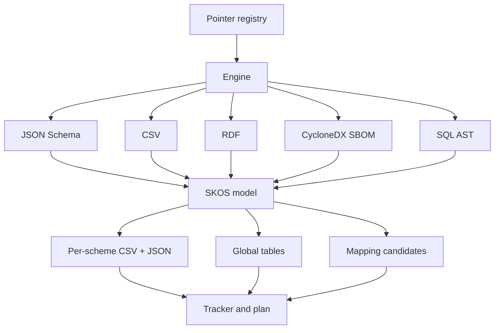

Universal Federated Schema Architecture — a configuration-driven, SKOS-grounded reference engine.

UFSA v2 normalizes diverse public standards (FHIR, ISO, IANA, SKOS, Shopify, OpenFIGI, SBOMs, SQL DDL) into a single semantic layer and a set of portable tables you can ingest anywhere.

What you’ll find here:

- A concise architecture overview and pipeline diagram
- Reference pages for the registry, emitters, profiles/overlays, and identifier/mapping registries
- Deep-dive research notes (moved under Research) that motivated the v2 target design

Quick links:

- Target architecture: ref/0 — summary of the approach with pointers to research
- Registry & emitters: ref/1 — how inputs are declared and outputs are produced
- Profiles/Overlays: ref/2 — contextual constraints over base structures
- Identifiers & mappings: ref/3 — modeling FIGI/ISIN/etc. and preferences

The engine is declarative: you add or update standards by editing a registry, not changing code.

## Architecture diagram

### Pipeline stages at a glance

| Stage | Purpose | Sources | Key components | Outputs |
|---|---|---|---|---|
| Declaration | Declare which specs to ingest | YAML registry | `ufsa_v2/registry/pointer_registry.yaml` | Plan for parsers |
| Ingestion | Acquire source artifacts | Local fixtures (now); HTTP with cache/pin (later) | Fetcher, scraper | Raw spec files |
| Parsing/Materialization | Turn spec structure into typed entities | JSON Schema, CSV, RDF, CycloneDX, SQL DDL | Parsers in `ufsa_v2/parsers/` | Concepts, schemes, relations |
| Normalization | Align to SKOS model | — | Core model in `ufsa_v2/core_models.py` | Unified in‑memory graph |
| Emission | Persist portable tables | — | Emitters in `ufsa_v2/emitters/` | Per‑scheme CSV/JSON + global tables |

### Inputs → Outputs map

| Input type | Example fixture | Parser | Primary outputs |
|---|---|---|---|
| JSON Schema | FHIR R4 Patient | `parsers/json_schema.py` | Scheme + concepts + relations |
| CSV | ISO 4217 currency table | `parsers/csv_schema.py` | Concepts with notations/labels |
| RDF/SKOS | SKOS Core | `parsers/rdf_skos.py` | Enriched labels/definitions/mappings |
| CycloneDX SBOM | cyclonedx_example | `parsers/cyclonedx.py` | `software_components.csv` |
| SQL DDL | internal_dw_schema | `parsers/sql_ast.py` | `database_schemas.csv` |

### Features and maturity

| Capability | Status | Notes |
|---|---|---|
| JSON Schema parser | ✅ Stable | Extracts properties/definitions → SKOS concepts and relations |
| CSV schema parser | ✅ Stable | Structured field CSVs (FHIR, ISO, IANA, Shopify, OpenFIGI) |
| RDF/SKOS ingester | ✅ Stable | Loads core SKOS vocabulary for labels/definitions/mappings |
| CycloneDX SBOM parser | 🟡 Beta | Emits `software_components.csv` with hashes/licenses/refs |
| SQL DDL → AST parser | 🟡 Beta | Emits `database_schemas.csv`, basic FK detection |
| Profiles evaluator | 🟡 Experimental | Apply/check constraints against build outputs |
| Identifier/Mapping registries | 🟡 In progress | Curated links across identifier systems and schemes |

## Next steps

- Run the pipeline locally (see README) to generate the tables under build/
- Browse the Research section for the long-form documents that informed UFSA v2
- Open an issue or PR with a new registry entry to add standards
