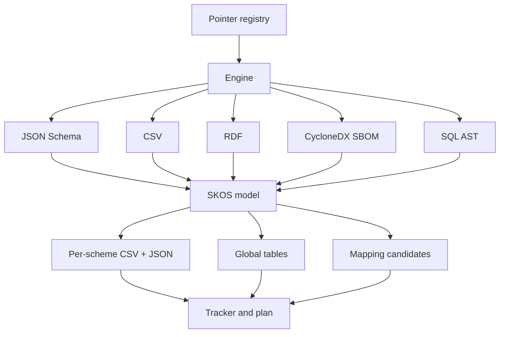

Universal Federated Schema Architecture — a configuration-driven, SKOS-grounded reference engine.

Use the sidebar to explore architecture docs and API reference.

## Architecture diagram

```mermaid
flowchart TB
  PR[Pointer registry]
  ENG[Engine]
  PJSON[JSON Schema]
  PCSV[CSV]
  PRDF[RDF]
  PSBOM[CycloneDX SBOM]
  PSQL[SQL AST]
  SKOS[SKOS model]
  PER[Per-scheme CSV + JSON]
  GLOB[Global tables]
  CAND[Mapping candidates]
  TRK[Tracker and plan]

  PR --> ENG
  ENG --> PJSON
  ENG --> PCSV
  ENG --> PRDF
  ENG --> PSBOM
  ENG --> PSQL

  PJSON --> SKOS
  PCSV  --> SKOS
  PRDF  --> SKOS
  PSBOM --> SKOS
  PSQL  --> SKOS

  SKOS --> PER
  SKOS --> GLOB
  SKOS --> CAND

  PER  --> TRK
  GLOB --> TRK
  CAND --> TRK
```
